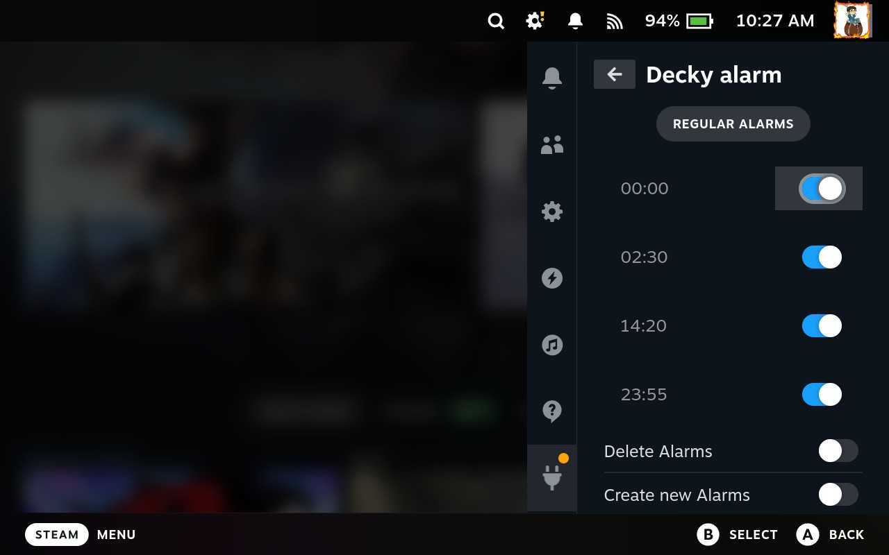
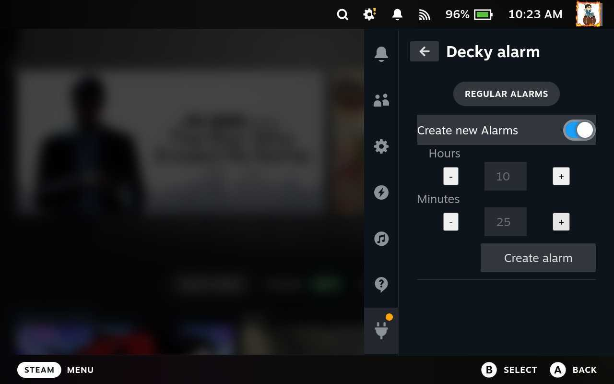

# Decky Alarm plugin

## Description

A plugin that let's you configure several alarms that will be displayed as toast

Built with [Decky Loader](https://github.com/SteamDeckHomebrew/decky-loader).

## Features

-   Configure clock time alarms
-   Whenever an alarm is triggered, a toast will be shown
-   Alarms can be disabled or deleted

## Screenshots

Home screen

Creating a new alarm

Alarms will show even if you play !
